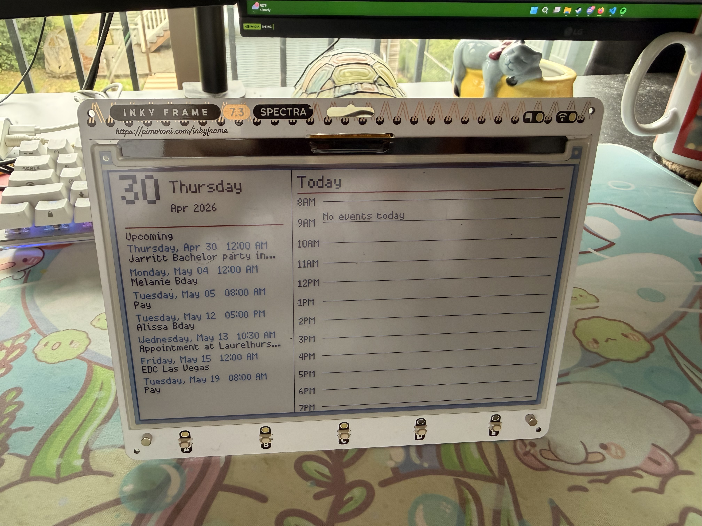

# What the heck is this

After 25 years on this earth with little to no calendar usage, and some missed personal events (thankfully my work calendar is up to date!), I realized something had to change. I wanted to start using my Google calendar more, but couldn't find the inspiration to do so. That was until I stumbled accross this GitHub repo/project while looking at fun raspberry Pi projects: https://github.com/zli117/EInk-Calendar.

I loved this idea, but wanted to challenge myself to make my own customized version of it, and on an existing eInk display that I own (with a built in Pico!). So I got to work developing and here is what I came up with!

A MicroPython calendar dashboard for the Pimoroni Inky Frame 7.3" (Spectra 6-color) with Pico 2 W. Displays upcoming events from Google Calendar (or any iCal feed) on the left panel and a timeline of today on the right panel. It updates every hour.



## Hardware used/needed

- I am using a Pimoroni Inky Frame 7.3" with Pico 2 W (RP2350). You should be able to tinker with the code to customize it to your own display.

## How it works

- My `app.py` file runs on PythonAnywhere as a Flask server. It fetches iCal feeds, handles recurring events, and returns the next 30 days of events as JSON.
- The `main.py` runs on the Inky Frame. It connects to WiFi, grabs the JSON from the server, and draws the dashboard.
- `secrets.py` holds your WiFi credentials and the Flask server URL.

## Setup

### Server (PythonAnywhere)

1. Create a free account at pythonanywhere.com
2. Open a Bash console and clone or upload `app.py`
3. Install dependencies:
   ```
   pip3.10 install --user flask icalendar recurring-ical-events requests
   ```
4. Edit `app.py` and add your iCal URLs and timezone
5. Set up a web app pointing to `app.py` via the Web tab
6. Reload and verify `https://yourusername.pythonanywhere.com/events` returns JSON

### Inky Frame

1. Install Thonny (thonny.org)
2. Connect the Inky Frame via USB and select MicroPython (Raspberry Pi Pico) in Thonny
3. Copy `secrets.py` and `main.py` to the Pico, filling in your credentials
4. Run `main.py` — the dashboard will appear after connecting to WiFi

## Getting your iCal URL

- **Google Calendar**: Settings → your calendar → Secret address in iCal format
- **Apple Calendar**: Right click calendar → Share Calendar → Public Calendar → copy link, change `webcal://` to `https://`

## Notes

- Use `http://` not `https://` in `SERVER_URL', I found that HTTPS is too heavy for the Pico
- The dashboard refreshes every hour using `time.sleep`, this function can cause some headaches, and trial and error was needed to get it working right
